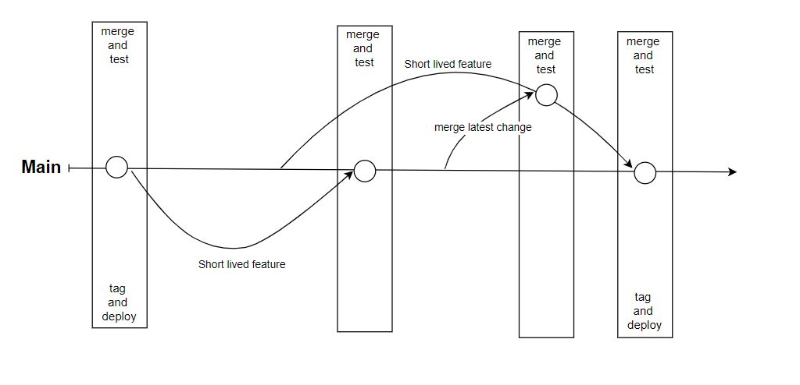

# Trunk-Based Development with GitHub: A Guide for enterprise Developers

Welcome to our enterprise development blog! Today, we're going to introduce you to trunk-based development and how we've successfully implemented this approach in enterprise using GitHub. If you're a developer at our enterprise, this guide will help you understand the benefits of trunk-based development and how to effectively use it in your daily work.

## What is Trunk-Based Development?

Trunk-based development is a software development approach where all developers work on a single, shared branch called the "trunk" or "main" branch. Instead of using multiple long-lived feature branches, developers create short-lived branches for specific tasks, bug fixes, or features, and then merge their changes back into the main branch through pull requests.

This approach minimizes the risks and difficulties associated with merging multiple branches, promotes collaboration, and ensures the codebase remains stable and up-to-date.

## Why Trunk-Based Development at our enterprise?

At our enterprise, we have a large and diverse team of developers working on multiple projects simultaneously. To maintain a high-quality codebase and deliver projects efficiently, we've chosen trunk-based development as our preferred development approach. By using trunk-based development, we can:

1. Improve collaboration among our developers, as everyone works on a single, shared codebase.
2. Accelerate development by reducing the time spent on merging multiple branches and resolving conflicts.
3. Maintain code stability by ensuring that the main branch is always in a releasable state, with automated testing and builds.

## Trunk-Based Development Workflow at our enterprise

Here's a step-by-step guide on how we use trunk-based development with GitHub at our enterprise:

### 1. Main Branch

We set up a single "main" branch in each GitHub repository, which serves as the central point of collaboration for all developers. This main branch contains the latest stable version of the codebase.

### 2. Short-Lived Branches

When you start working on a new feature, bug fix, or task, create a short-lived branch off the main branch. Use a naming convention like "feature/description" (e.g., "feature/add-login-functionality").

### 3. Frequent Commits

Commit your changes frequently to your short-lived branch, ensuring your work is regularly saved and backed up.

### 4. Continuous Integration

At our enterprise, we use a Continuous Integration (CI) system, like Jenkins or GitHub Actions, to automatically build and test the code from short-lived branches. This helps to catch issues early and ensures that the code is always in a releasable state.

### 5. Code Reviews

Once your work on a short-lived branch is complete, create a pull request to merge the changes back into the main branch. Your pull request will be reviewed by other team members, who will provide feedback, request changes, or approve the changes.

### 6. Merging

After your pull request is reviewed and approved, the changes are merged into the main branch. The CI system automatically builds and tests the main branch to ensure the new changes don't introduce any issues.

### 7. Release

Periodically, we release new stable versions of our projects by tagging specific commits in the main branch. These tagged releases can then be deployed to production environments.

## Implementation 

To be decided

## Conclusion

By following this approach, our developers can collaborate more effectively, resolve issues quickly, and maintain a stable and high-quality codebase. We hope this guide helps you understand the benefits of trunk-based development and how to implement it in your work at our enterprise. Happy coding

## References

1. [Trunk-Based Development official website](https://trunkbaseddevelopment.com/)
   - This site provides a comprehensive explanation of trunk-based development, its benefits, and how it differs from other development approaches.

2. [Continuous Integration (CI)](https://www.atlassian.com/continuous-delivery/continuous-integration/trunk-based-development)
   - This Atlassian guide explains the concept of Continuous Integration, an essential practice for trunk-based development, and provides an overview of various CI tools and best practices.

3. [Feature Toggles (Feature Flags)](https://www.martinfowler.com/articles/feature-toggles.html)
   - Trunk-based development often employs feature toggles to manage the release of new features or functionality. This article by Martin Fowler provides a detailed explanation of feature toggles and their use cases.
